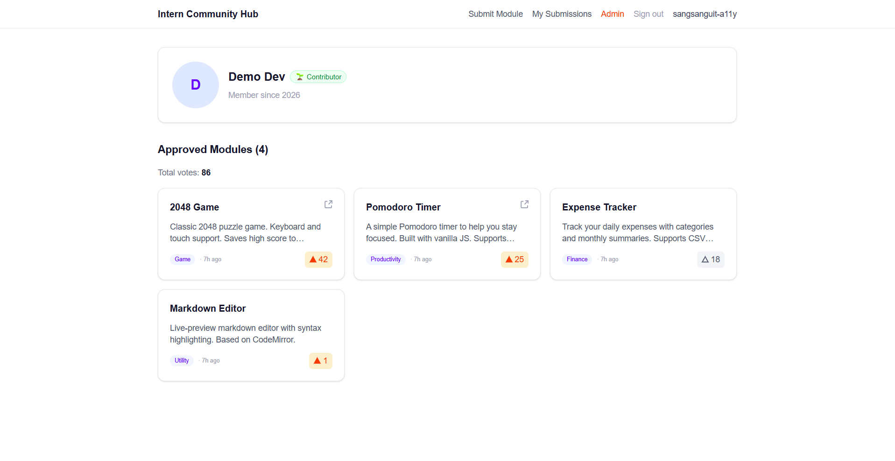

## What does this PR do?

Adds a public developer profile page at `/profile/[userId]`. Anyone can view
a developer's approved modules, live total votes, and earned badge (Contributor,
Top Contributor, Elite Contributor). Also updates `ModuleCard` to link the author's
name to their profile page.

## Goal

A public profile page lets community members view a developer's contributions:
approved modules, total votes received, and an earned badge. This is a
self-proposed feature (not in the issue list) aimed at increasing community
engagement and giving contributors visibility into each other's work.

## Implementation

- `src/app/profile/[userId]/page.tsx` — Server Component, fetches user + approved modules + votedIds
- `src/components/profile-header.tsx` — Displays avatar, name, and badge based on approved module count
- `src/components/profile-module-list.tsx` — Client Component that owns `totalVotes` state;
  each card calls `onVoteChange(+1 | -1)` to update the counter instantly on vote
- `src/components/module-card.tsx` — Author name is now a link to `/profile/[userId]`
- `next.config.ts` — Added `avatars.githubusercontent.com` to `remotePatterns` for `next/image`

## How to test

1. Run `pnpm dev`
2. Open Prisma Studio (`pnpm db:studio`) and grab a real `userId` from the `users` table
3. Visit `http://localhost:3000/profile/{userId}` — should see header + approved modules
4. Click an author name on any module card — should navigate to their profile
5. Vote on a module — total votes counter should update instantly without page reload
6. Visit `http://localhost:3000/profile/nonexistent-id` — should return 404

## AI usage

I used Claude throughout this task in the following ways:
- Summarizing the codebase quickly to get a clear picture of the project structure,
  technical requirements, and existing patterns before writing any code
- Accelerating implementation by generating boilerplate and proposing solutions
  to specific problems (e.g. how to update `totalVotes` reactively without `router.refresh()`)
- Reviewing code and logic to catch mistakes and ensure correctness

All generated code was read and understood before being integrated. I made manual
adjustments where needed to stay consistent with the codebase's conventions
(e.g. preserving the "DO NOT remove include" comment pattern in Prisma queries).

## Screenshots / recordings

## Checklist

- [x] I read the relevant code **before** writing my own
- [x] My code follows the existing patterns in the codebase
- [x] I ran `pnpm lint` and `pnpm typecheck` locally — no errors
- [x] I added or updated tests where applicable
- [x] I can explain every line of code I wrote (reviewer will ask)
- [x] I kept the PR focused — no unrelated changes

## Notes for reviewer

- Total votes is calculated via `.reduce()` on `submissions` already fetched —
  avoids an extra DB round-trip compared to using `aggregate`.
- Kept the `include: { category: true }` on the submissions query intentionally
  to avoid N+1, consistent with the pattern in `page.tsx` and `db.ts`.
- Badge thresholds (1/5/10 approved modules) are defined in `profile-header.tsx`
  and can be adjusted easily without touching other files.
- Added `avatars.githubusercontent.com` to `next.config.ts` image remotePatterns
  — required for `next/image` to load GitHub avatars.
- `ProfileModuleList` is a Client Component that owns `totalVotes` state. Each
  card calls `onVoteChange(+1 | -1)` after toggling, so the counter updates
  optimistically without a page reload or router.refresh().