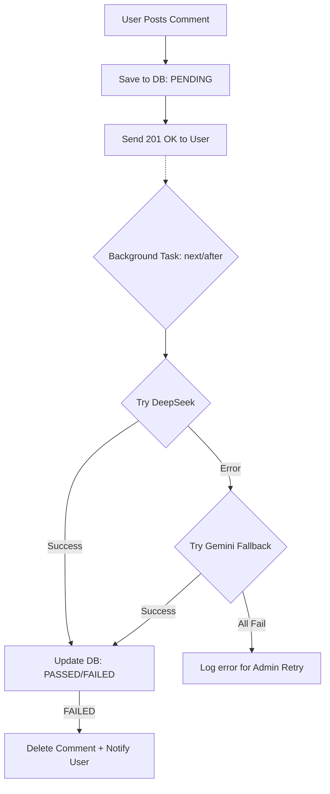

# 🚀 Intern Community Hub — Social & AI Enhanced

> An open-source community hub built for the TD developer ecosystem, featuring a robust social architecture and AI-driven moderation. This project is my submission for the **Internship Challenge (Issue #199)**.


---

## ✨ Features Implemented (Issue #199)

### 💬 Advanced Comment System
- **Nested Discussions**: Single-level threading for focused replies.
- **Optimistic Updates**: Zero-latency UX — comments appear instantly while the server syncs in the background.
- **Management**: Authors can Edit/Delete their contributions; Admins have full moderation control.

### 🤖 AI-Driven Background Moderation
To ensure a safe community without sacrificing speed, I implemented an **Asynchronous Moderation Engine**:
- **Background Processing**: Uses Next.js `after()` API to perform AI checks *after* the HTTP response is sent.
- **Provider Fallback (Resilience)**:
  - **Primary**: DeepSeek (`deepseek-chat`) for high-quality cost-effective checks.
  - **Backup**: Multi-model Gemini fallback (`gemini-2.5-flash` → `gemini-flash-latest`) if DeepSeek is down or limited.
- **Automatic Enforcement**: Flagged comments are automatically deleted and authors are notified via the in-app bell icon.

### 🌗 Premium UI/UX
- **Dynamic Dark/Light Mode**: Full theme support with system preference detection and `localStorage` persistence.
- **In-place Emoji Picker**: Rich expression with a custom picker supporting cursor-position insertion.
- **Real-time Notifications**: Custom notification system to alert users about moderation actions or submission updates.

---

## 🏗️ Technical Architecture

### Comment Moderation Flow (Mermaid)



### Tech Stack Refresher
- **Framework**: Next.js 16 (App Router + Turbopack)
- **Database**: PostgreSQL with Prisma ORM
- **Auth**: NextAuth.js v5 (Auth.js)
- **AI Engine**: DeepSeek API + Google Generative AI (Gemini)
- **Styling**: Tailwind CSS (with specific Dark-theme layers)

---

## 🛠️ Installation & Setup

### 1. Prerequisites
- Node.js 20+
- pnpm / npm
- Docker (for DB)

### 2. Environment Configuration
Create a `.env` file from the template and add your AI keys:

```env
# Database
DATABASE_URL="postgresql://..."

# Auth (GitHub)
AUTH_SECRET="..."
AUTH_GITHUB_ID="..."
AUTH_GITHUB_SECRET="..."

# AI Moderation (Crucial for Issue #199)
DEEPSEEK_API_KEY="sk-..."
GEMINI_API_KEY="AIza..."
```

### 3. Run Locally
```bash
npm install
docker compose up -d
npx prisma db push
npm run dev
```

---

## 🧪 Testing Strategy
I have implemented unit and integration tests to ensure logic reliability:
- **Slug Generation**: Testing edge cases for module URL creation.
- **Relative Time**: Verifying localized "n minutes ago" formatting.
- **Moderation Fallback**: Mocking AI provider failures to ensure the fallback logic successfully tries the next provider.

To run tests:
```bash
npm test
```

---

## 💡 Thought Process & Impact
The core challenge of **Issue #199** was balancing **Security** vs **Performance**. Blocking the main thread for AI moderation (which can take 1-3 seconds) is a poor user experience. By offloading this to a background worker and using optimistic UI, the user feels the app is "instant," while the community remains protected by state-of-the-art LLMs.

**Submission by**: [Trần Anh Đức/duc19092005]
**Date**: 7th April 2026
