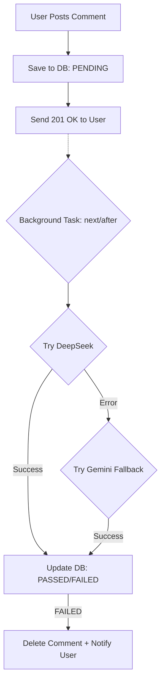

# 🌟 Báo cáo hoàn thiện tính năng (Issue #199)

Dưới đây là tóm tắt chi tiết các giải pháp kỹ thuật đã triển khai cho hệ thống Social & AI Moderation của dự án **Intern Community Hub**.

---

## 📋 Phạm vi triển khai
Mục tiêu là xây dựng một hệ thống tương tác cộng đồng hoàn chỉnh, mượt mà và an toàn, bao gồm:
- **Hệ thống Bình luận/Thảo luận**: Hỗ trợ lồng nhau, chỉnh sửa/xóa và kiểm duyệt.
- **AI Moderation**: Tự động hóa việc kiểm soát nội dung độc hại.
- **Emoji Picker**: Tối ưu hóa trải nghiệm nhập liệu.
- **Dark/Light Mode**: Giao diện linh hoạt theo sở chuẩn người dùng.
- **Notification Feed**: Theo dõi hoạt động cộng đồng trong thời gian thực.

---

## 🎯 Chi tiết các tính năng chính

### 1. Hệ thống Bình luận (Comments System)
- **Nested Replies**: Hỗ trợ trả lời lồng nhau (1 cấp) để giữ cuộc thảo luận mạch lạc.
- **Management**: Người dùng có quyền sửa/xóa comment của mình. Admin có quyền quản lý toàn cục.
- **Optimistic UX**: Sử dụng React state để cập nhật UI ngay lập tức giúp tạo cảm giác ứng dụng phản hồi siêu tốc.

### 2. Kiểm duyệt bằng AI (AI Moderation Engine)
Đây là phần cốt lõi đảm bảo an toàn cho nền tảng:
- **Xử lý bất đồng bộ**: Sử dụng Next.js `after()` API. Sau khi User gửi comment, Server sẽ phản hồi ngay lập tức để User không phải chờ. Việc gọi AI kiểm tra sẽ diễn ra âm thầm sau đó.
- **Priority Provider**:
  1. **Primary (DeepSeek)**: Model `deepseek-chat` được ưu tiên nhờ tốc độ và độ chính xác cao.
  2. **Backup (Gemini)**: Nếu DeepSeek quá tải hoặc lỗi, hệ thống tự động fallback sang `gemini-2.0-flash`.
- **Enforcement**: Nếu phát hiện từ ngữ vi phạm, hệ thống sẽ tự động xóa comment và gửi thông báo cho tác giả.

### 3. Hệ thống Thông báo (Notification System)
- **Bell Icon**: Hiển thị số lượng thông báo chưa đọc trên Navbar.
- **Tự động cập nhật**: Hệ thống tự động fetch thông báo mới sau mỗi 15 giây.
- **Loại thông báo**:
  - Bình luận của bạn bị xóa do vi phạm tiêu chuẩn cộng đồng.
  - Module của bạn được phê duyệt/từ chối (mở rộng sau này).

### 4. Emoji Picker & Theme Toggle
- **Emoji Picker**: Chèn emoji chính xác tại vị trí con trỏ trong textarea.
- **Theme Engine**: Đồng bộ giao diện Dark/Light Mode bằng Tailwind CSS và giữ trạng thái qua `localStorage`.

---

## 🏗️ Technical Architecture

### Moderation Logic Flow

---

**Người thực hiện**: Trần Anh Đức
**Github**: duc19092005
